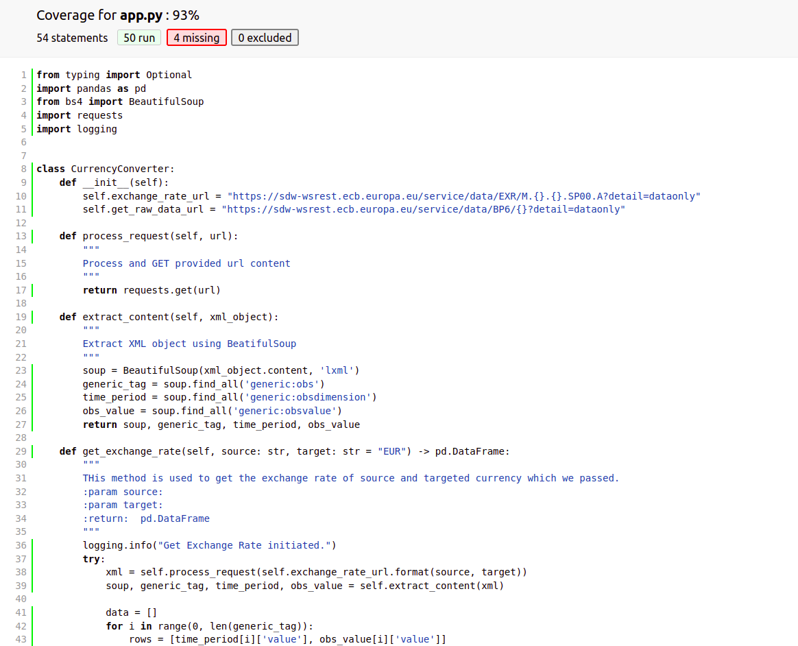
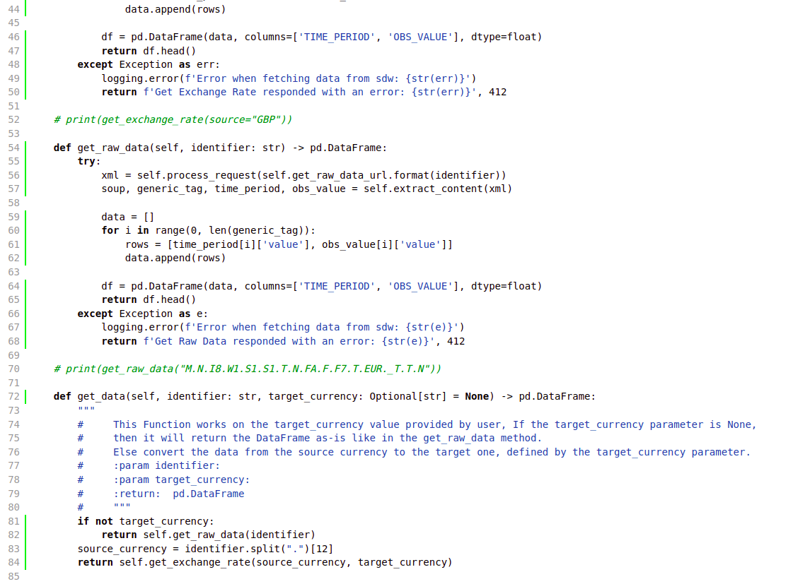
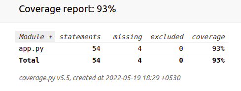

This is a currency converter which is use to fetch the converted convercy against the provided one.

## Installation
Clone the code using below URL 
```bash
git clone https://github.com/Shubham-Ikhar/CurrencyConverter.git
```
------------
## Create Virtual ENV
- Create a virtual environment before installing dependencies.
```bash
python -m venv venv
```
-----------------

## After Installation Steps

After installation, you should have ``currencyConverter`` in your ``$PATH``:
- Download all the dependencies from requirements.txt file using below command:
```bash
pip install -r requirements.txt
```bash
- Then from your terminal you can run your application using command:
```bash
python app.py
```
-----------------
## Test Cases
- To run the test cases use command:
```bash
python test_app.py OR pytest -v test_app.py
```
-----------------
## Code Coverage in HTML & Report Format
- To  get the code coverage I use `coverage` module.
- To get the code coverage in HTML format use command:
```bash
coverage html app.py
```
```bash
coverage report app.py
```
-----------------

## Code Coverage in HTML format:


-----------------
## Code Coverage in Report format:

 -----------------
## Python API 1
-  Exchange rate data can be retrieved from the REST API of the European Central Bank, using the URL below: https://sdw-wsrest.ecb.europa.eu/service/data/EXR/M.GBP.EUR.SP00.A?detail=dataonly
- In the URL above, GBP is the source currency and EUR is the target one. These values can be replaced with
any combination of currency codes (e.g. PLN.EUR).
- This Function fetch the exchange rate data from the appropriate URL and convert it to a pandas DataFrame, with columns TIME_PERIOD and OBS_VALUE.
### METHOD SIGNATURE
```python
def get_exchange_rate(self, source: str, target: str = "EUR") -> pd.DataFrame:
```
---------

## Python API 2

- Other data of interest can be be retrieved from the REST API of the European Central Bank, using the URL
below: https://sdw-wsrest.ecb.europa.eu/service/data/BP6/M.N.I8.W1.S1.S1.T.N.FA.F.F7.T.EUR._T.T.N?detail=dataonly
- This Function fetch the data from the appropriate URL and convert it to a pandas DataFrame.
### METHOD SIGNATURE
```python
def get_raw_data(self, identifier: str) -> pd.DataFrame:
```
---------

## Python API 3

- If the target_currency parameter is None, leave the resulting DataFrame as-is. If the target_currency parameter is not None, convert the data from the source currency to the target one, defined by the target_currency parameter. Exchange rates for the currency conversion should be retrieved using the function described in part #1.
### METHOD SIGNATURE
```python
def get_data(self, identifier: str, target_currency: Optional[str] = None) -> pd.DataFrame:
```
